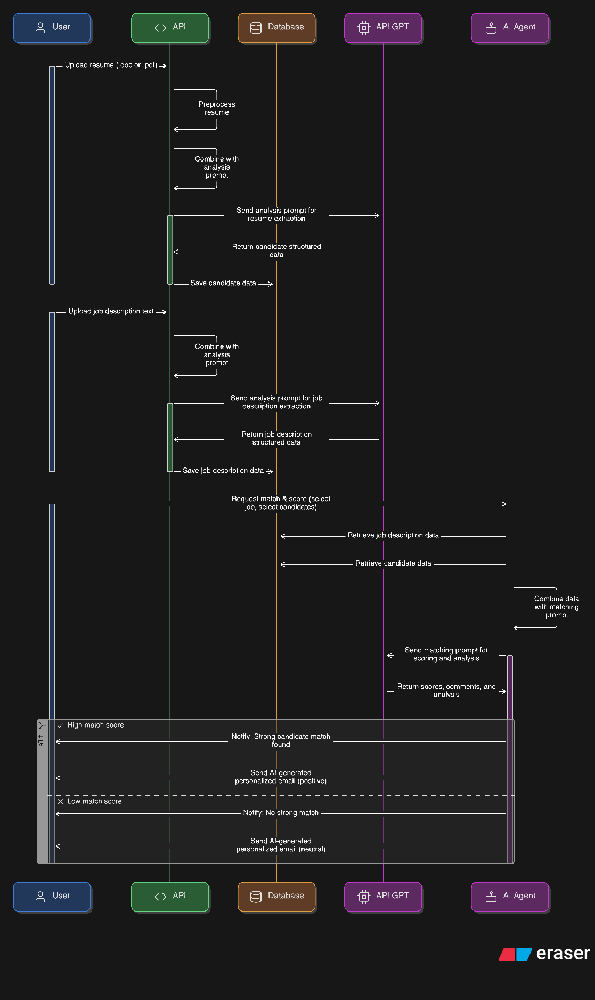

# Resume Ranking Application

To know more click [here](https://blogs.sayande.com/filter-resumes-with-agentic-ai-langchain-and-lanhgraph)

## Feature Overview

- **✅ AI-Powered Recruitment Tool for Intelligent Candidate-Job Matching**
- **🚀 Built with FastAPI, Next.js, and OpenAI's GPT Model**
- **🔍 Advanced Resume and Job Description Analysis**
- **📊 Detailed Scoring and Analysis**
- **📈 Intelligent Ranking System**
- **✉️Email Response with Gmail Toolkit**

## Overview

The Resume Ranking Application is an AI-powered recruitment tool that leverages Large Language Models (LLM) and advanced NLP techniques to automatically evaluate, analyze, and rank resumes based on job requirements. Built with FastAPI, Next.js, and OpenAI's GPT models, it provides intelligent candidate-job matching with detailed scoring and analysis.

Click the image above to watch the demo video on YouTube.

## Sequence Diagram

<p align="center">
  
  <br>
  <em>Sequence Diagram</em>
</p>

## Key Technologies

- **Backend**: FastAPI, Flask, MongoDB
- **Frontend**: Next.js, TypeScript, TailwindCSS
- **AI/ML**: OpenAI GPT models, LangChain, LangGraph
- **Infrastructure**: Docker, Nginx, GitHub Actions, AWS

## Features

### Job Description Analysis

- **Intelligent JD Parsing**:
  - Extracts key requirements, skills, and qualifications using LLM
  - Structures data into standardized format for matching
  - Supports multiple languages through GPT's multilingual capabilities
  - Average processing time: 3 seconds

### Resume Analysis

- **Advanced CV Processing**:
  - Handles PDF and Word documents
  - Extracts and structures candidate information using LLM
  - Identifies skills, experience, and qualifications
  - Supports multilingual resumes
  - Average processing time: 5-10 seconds

### AI-Powered Matching

- **Sophisticated Matching Algorithm**:
  - Uses LangChain for orchestrating complex LLM operations
  - Function calling for structured data extraction
  - Semantic understanding of job requirements and candidate qualifications
  - Many-to-many relationship support
  - Average processing time: 3-5 seconds

### Intelligent Ranking

- **Smart Evaluation System**:
  - Generates detailed match analysis using GPT models
  - Provides scoring based on multiple criteria
  - Offers AI-generated feedback and comments
  - Ranks candidates based on overall fit

## Technical Features

- **FastAPI Integration**:

  - Async request handling
  - Automatic API documentation with Swagger UI
  - Type validation with Pydantic models

- **LangChain Implementation**:

  - Custom prompt engineering
  - Structured output parsing
  - Chain of thought reasoning

- **OpenAI Function Calling**:

  - Structured data extraction
  - Consistent output formatting
  - Enhanced control over LLM responses
  - Consistent formatting for downstream processing

- **LangGraph Workflow**:
- Workflow automation for complex LLM tasks
- Integrated Gmail Toolkit for parsing and analyzing email content
- Derives structured insights from raw email threads
- Email analysis time: ~2–4 seconds

<!-- ## Documentation

Detailed documentation on system architecture, API endpoints, and configuration options is available in the [User Guide](./assets/presentation.pdf). -->

## Getting Started

1. **Clone the Repository**:

   ```bash
   git clone https://github.com/sayandedotcom/recruitment.ai
   ```

2. **Configure Environment**:

   - Set up OpenAI API key:

     ```bash
     # analysis_service/.env
     OPENAI_API_KEY="your-key"
     ```

3. **Get credendials.json file**
   To use Gmail Toolkit, you will need to set up your credentials explained in the Gmail API docs. Once you've downloaded the credentials.json file, you can start using the Gmail API. Upload the credentials.json file to the root directory of the `analysis_service` folder.

   ```shell
   https://developers.google.com/workspace/gmail/api/quickstart/python#authorize_credentials_for_a_desktop_application
   ```

4. **Build and Run**:

   ```bash
   cd recruitment.ai
   docker compose build
   docker compose up
   ```

5. **Access Application**:
   - `http://localhost:8080/`

<!-- ## Development

- **Code Quality**:

  - Ruff for Python linting
  - ESLint for TypeScript/JavaScript
  - Pre-commit hooks for code formatting

- **Testing**:

  - Unit tests with pytest
  - Integration tests for API endpoints
  - Frontend testing with React Testing Library

- **CI/CD**:
  - Automated testing with GitHub Actions
  - Docker image builds
  - Deployment automation -->

## License

This project is licensed under the [MIT License](LICENSE).
